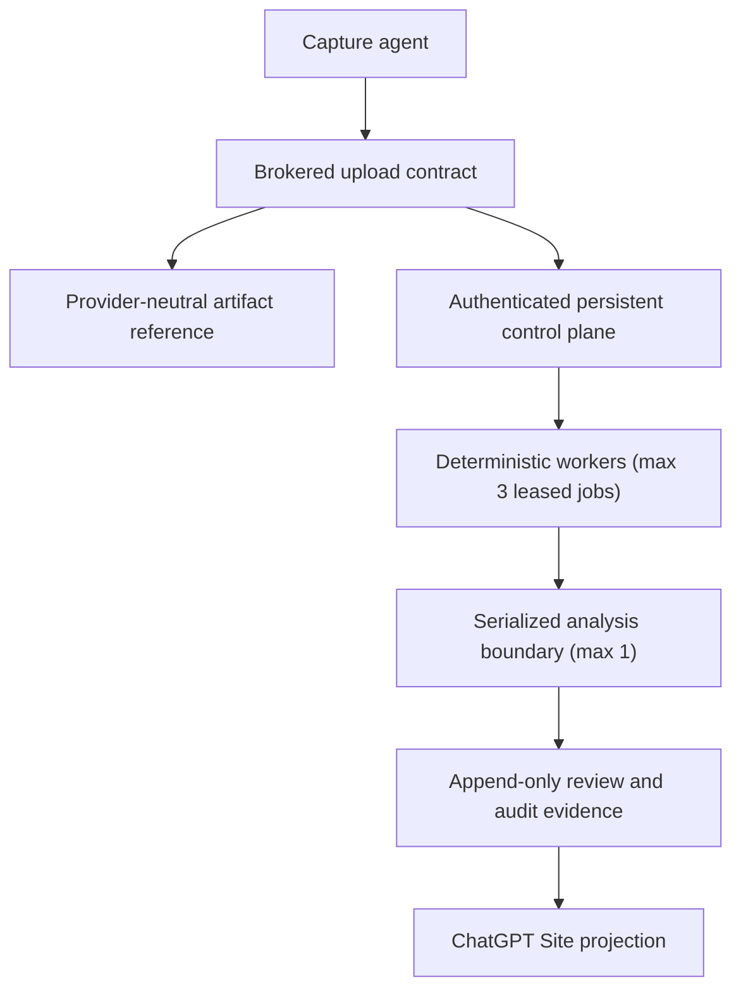

# Architecture

## Intended source-of-truth boundaries

Google Drive is the intended artifact system of record for raw, review,
processed, failed, and approved-dataset artifacts. Folder location is a
human-readable projection, never workflow state. The authenticated persistent
control plane owns job state, leases, fencing tokens, review decisions, audit
events, and later retention records. The ChatGPT Site is a private presentation
and review layer; it cannot become authoritative storage or bypass the control
plane.

This is the approved future design, not a description of the default Compose
runtime. Google Drive is not connected, no Drive folders or OAuth scopes are
created, and no Site is deployed. S3/LocalStack remains an explicit
compatibility and rollback path while Drive parity is developed. Provider
selection must never fall back automatically.

## Artifact storage

Provider-neutral processing contracts identify an artifact through
`ArtifactRef`:

- `provider`: `google_drive` or `s3`
- provider-issued immutable `file_id` and `revision`
- SHA-256, exact byte size, MIME type, and artifact role

Consumers resolve artifacts by ID and verify revision, size, and hash. They do
not search by filename or folder. Upload authorization is represented by
short-lived, size-limited `UploadTicket` contracts; credentials must never reach
the browser or capture agent. The in-repository Drive store is a hermetic fake
used to specify these integrity semantics, not a network Drive adapter.

The canonical logical Drive projection, once live prerequisites are separately
approved and verified, is:

- `00_Unprocessed/`
- `10_Review/<job_id>/`
- `20_Processed/<job_id>/`
- `90_Failed/<job_id>/`
- `99_Approved_Datasets/<dataset_version>/`

Names are for navigation only. Artifact identity is provider ID, revision,
SHA-256, size, MIME type, role, and schema version. State transitions are
controlled by the durable ledger and append-only evidence, not by folder moves.
Changed identifiers, revisions, hashes, sizes, or permissions must fail closed.

## Implemented code boundaries

The default API image remains deliberately inert. The module-global application
is `create_app()` with no `SealedSyntheticRuntimeBundle`; its image command is
still `workflow_api.main:app` and performs no environment, path, database,
provider, SDK, or credential discovery. It has zero allowed CORS origins,
serves only `GET /health` as usable (`environment=unconfigured`), returns `404`
for `/docs`, `/redoc`, and `/openapi.json`, and returns bounded `503`
responses from all protected operations.

Compose remains a compatibility topology, not an end-to-end implementation of
the intended diagram. Its `api` service has an explicit command override to
`workflow_api.dev_server`, but only when the caller supplies an explicit
dev-like environment, a fresh absolute data directory, and fresh synthetic
proof/session material. That entrypoint constructs the sealed
`create_in_process_no_network_bundle()` graph, binds `create_app(bundle)`, and
uses six component-local SQLite stores plus the no-network artifact oracle.
The default image command remains inert. Compose still starts PostgreSQL and
LocalStack, but no dev API or worker code opens PostgreSQL and the synthetic
dev API does not claim a worker queue, candidate producer, or web readback
slice. The named PostgreSQL volume is unused application state.

The repository contains an `InMemorySessionRepository`, but no runtime
dependency installs it. It also contains durable SQLite reference components,
including `SQLiteLegacySessionStore`, browser-session, control, retention, and
safety stores. Those classes provide synthetic code/test evidence; they are not
constructed by the default application or Compose.

ADR 0012 defines a sealed, no-network synthetic bundle that binds exact
preconstructed SQLite and service objects. Only a separately created
`create_app(bundle)` installs that graph. The bundle uses an in-process metadata
oracle, accepts no payload bytes, opens no provider connection, and never
mutates the module-global app. `workflow_api.dev_server` is the explicit
synthetic development command: its outer guard rejects non-dev environments,
ambient Google/AWS provider sources, missing or malformed proof inputs, and
non-fresh data paths before constructing the bundle. Fixed synthetic principals,
scopes, policies, and authenticator/workload factories are created only inside
that guarded factory; raw proof material is not persisted.

The web app calls the session plane but catches non-success responses and
network failures. Its dashboard renders an empty session list; its detail route
renders not found. It does not distinguish service unavailability from genuine
absence. Phase 1 owns an explicit unavailable/error state; until then, web
emptiness is not readiness or successful readback evidence.

## Persistent control-plane reference

ADR 0003 established a SQLite-backed synthetic control-plane reference. When
explicitly constructed, it persists job registration, a global maximum of
three active leases,
owner/token/attempt/expiry fencing, heartbeat state, immutable/idempotent
completion, append-only review events, review projections, and append-only audit
evidence across process restarts. A lease may not exceed 30 minutes.

ADR 0004 added the fail-closed authenticated service boundary. Control routes are
unavailable unless a supported authenticator/service dependency is explicitly
injected. Exact supported roles are `deterministic_worker`, `reviewer`, and
`audit_reader`; header identity, development bypasses, bearer-token fallbacks,
wildcard roles, and request-supplied actor/owner identity are not accepted.
Accepted mutations and their accepted audit events are atomic.

These newer persistent/authenticated controls supersede the earlier PR #18
in-memory job-ledger prototype. This package therefore does not add a second
worker-local lease ledger.

## Session plane reference

The `/v1/sessions/**` and `/v1/internal/sessions/**` routes form the session
plane, distinct from the control plane. ADR 0008 defines its
browser and workload authorization, and ADR 0009 now has a hermetic SQLite
reference implementation for scoped session state, append-only events, durable
workload generations/revocations, and globally one-time proof claims. ADR 0010
composes verified identity/MFA, browser session integrity, workload credential
verification, and that exact same preconstructed store for all seven
session-plane routes. Provider-supplied active-generation, revocation, and
replay fields are not authoritative on composed routes.

ADR 0011 adds a separate, component-local SQLite reference for the browser
session lifecycle used by ADR 0007. It owns only canonical session-identifier
and CSRF digests, exact scoped principal/origin/timestamps, generation,
revocation, optimistic version, and an immutable one-time digest-allocation
history. Registration, read-only resolution, explicit bounded touch, atomic
dual-digest rotation, terminal revocation, non-reactivation of prior evidence,
and restart behavior are authoritative within that disposable database. It
neither accepts nor generates raw session or CSRF material and is not shared
with the session/control/audit/retention/safety stores.

The composition has no default installation. Importing or starting the default
application constructs no session-plane database or provider and leaves all
protected routes unavailable with bounded `503` responses. No live identity
provider, credential, database path, migration, deployment wiring, or
production claim is included. PostgreSQL and live-provider prerequisites remain
separately gated.

ADR 0012 adds one exact sealed synthetic runtime bundle. A fresh, separately
created app factory may
receive that already-constructed bundle and atomically bind the exact security
composition, the composition's exact session store, the exact store-backed
browser factory and its browser store, control service, safety service, explicit
synthetic settings snapshot, and no-network artifact oracle. Identity is an
invariant, not structural equivalence: split objects and subclasses are rejected
before collaborator calls. The module-level/default app still receives no
bundle, configures zero CORS origins, does no environment/path/provider/client/
database discovery, exposes health, and fails every protected operation closed.

The artifact oracle exists only to complete a hermetic integration proof. It
issues a deterministic inert reserved-`.example` ticket and retains only object
key, digest, size, and queue evidence. It accepts no raw payload and performs no
filesystem, SDK, signature, provider, or network operation. This does not alter
Drive-first authority or activate S3 compatibility behavior.

## Processing and analysis

Deterministic processors may execute concurrently only through the persistent
control-plane lease boundary, with a global maximum of three active leases.
Expired or superseded leases cannot publish results.

Model-assisted analysis is a separate serialized boundary with maximum
concurrency one. Each job must use fresh bounded context and minimum selected
evidence. The boundary fails closed if API-key environment variables are
present; it does not silently convert subscription-authenticated work into
metered API usage.

## Components

### Capture agent

A Windows background service detects a foreground process only when it matches
the configured AutoCAD allowlist. A coordinator opens and closes logical
sessions and writes an atomic package. Screen recording remains no-op by
default. Live capture is outside the current authorized boundary.

### API and control plane

The API code contains SQLite reference stores and fail-closed authenticated
service seams. The session plane has an explicitly injectable provider-neutral
security composition and durable SQLite reference store. A separate SQLite
reference specifies digest-only browser-session lifecycle authority. The sealed
runtime bundle can compose preconstructed synthetic authorities for a fresh app
without changing the default. Compose installs none of them and does not use
PostgreSQL. S3/LocalStack remains compatibility behavior. A live Drive adapter,
Google workload identity, production SSO/IdP integration, durable live stores,
and a real-data control plane remain future gated work.

### Worker

The worker converts verified evidence into compact timeline/keyframe outputs.
Deterministic preprocessing precedes optional analysis. This package adds
provider-neutral artifact integrity primitives and the serialized analysis
contract; it does not add live Google Drive or model-provider connectivity.

### ChatGPT Site

The intended Site presents queue status, session details, artifacts, provenance,
and human review actions through authenticated control-plane APIs. It must not
embed Drive credentials, expose unrestricted Drive links, or store authoritative
review state. No Site deployment is authorized by this code-only package.

### Current web scaffold

The checked Next.js app is a local scaffold, not the intended ChatGPT Site. It
masks API unavailability as an empty dashboard or not-found detail page and has
no authenticated browser-session composition. Phase 1 must add an explicit
unavailable UI before it can provide honest operational readback.

### S3 compatibility adapter

The existing S3/LocalStack path remains intact as the explicit compatibility and
rollback oracle. Removing AWS resources or flipping a default provider requires
a separate verified decision; no automatic fallback is allowed.

## Trust boundaries

1. Workstation to control plane: authenticated device identity and scoped upload authorization.
2. Control plane to Drive: future least-privileged workload identity; no browser token.
3. Worker to artifact store: one fenced leased job plus verified artifact reference.
4. Reviewer to control plane: authenticated human identity, role, and append-only audit event.
5. Analysis boundary: minimum selected evidence, isolated context, concurrency one, no API fallback.
6. Site boundary: authenticated projection only; no direct storage authority.

## Hard limits for the current code-only phase

- Added recurring cloud spend: `$0`
- Live workstations: `0`
- Real/project data storage or transfer: `0 bytes`
- Deterministic active lease maximum: `3`
- Maximum lease TTL: `30 minutes`
- ChatGPT analysis concurrency: `1`
- Artifact/package maximum: `512 MiB`
- Raw-retention target: `14 days`
- Automatic provider fallback: prohibited
- Automatic API-key/metered analysis fallback: prohibited

## Contract versioning

Existing `ProcessingJob` v1 and the S3/LocalStack path remain valid.
Provider-neutral jobs use `ProcessingJob` v2 with an `ArtifactRef`. Breaking
payload changes create a new contract version instead of silently changing
historical meaning.
